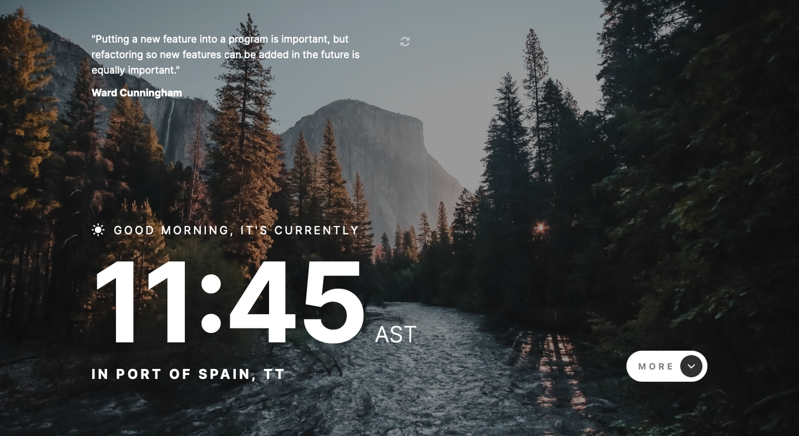

# Frontend Mentor - Clock app solution

This is a solution to the [Clock app challenge on Frontend Mentor](https://www.frontendmentor.io/challenges/clock-app-LMFaxFwrM). Frontend Mentor challenges help you improve your coding skills by building realistic projects.

## Table of contents

- [Overview](#overview)
  - [The challenge](#the-challenge)
  - [Screenshot](#screenshot)
  - [Links](#links)
- [My process](#my-process)
  - [Built with](#built-with)
  - [What I learned](#what-i-learned)
  - [Continued development](#continued-development)
  - [Useful resources](#useful-resources)
- [Author](#author)

## Overview

### The challenge

Users should be able to:

- View the optimal layout for the site depending on their device's screen size
- See hover states for all interactive elements on the page
- View the current time and location information based on their IP address
- View additional information about the date and time in the expanded state
- Be shown the correct greeting and background image based on the time of day they're visiting the site
- Generate random programming quotes by clicking the refresh icon near the quote

### Screenshot

### Links

- Solution URL: [https://www.frontendmentor.io/solutions/mobile-first-clock-app-8A5barIzy](https://www.frontendmentor.io/solutions/mobile-first-clock-app-8A5barIzy)
- Live Site URL: [https://nakoyawilson.github.io/frontend-mentor-clock-app/](https://nakoyawilson.github.io/frontend-mentor-clock-app/)

## My process

### Built with

- HTML
- CSS
- JavaScript
- Mobile-first workflow
- [World Time API](http://worldtimeapi.org/)
- [IP Geolocation API](https://freegeoip.app/)
- [Programming Quotes API](https://programming-quotes-api.herokuapp.com/)

### Useful resources

## Author

- Website - [Nakoya Wilson](https://nakoyawilson.netlify.app/)
- Frontend Mentor - [@nakoyawilson](https://www.frontendmentor.io/profile/nakoyawilson)
- Twitter - [@nakoyawilson](https://twitter.com/nakoyawilson)
- LinkedIn - [@nakoyawilson](https://www.linkedin.com/in/nakoyawilson/)
